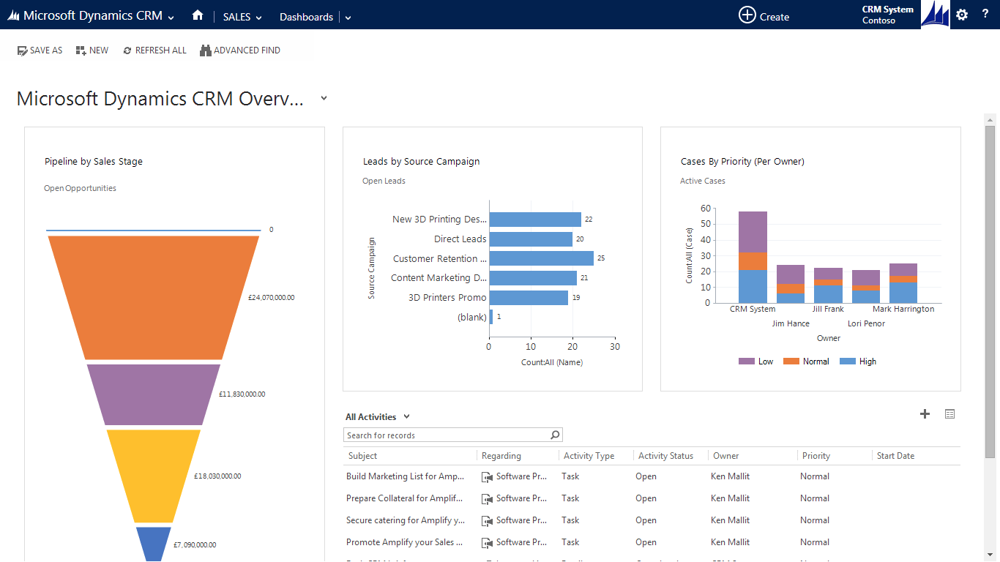
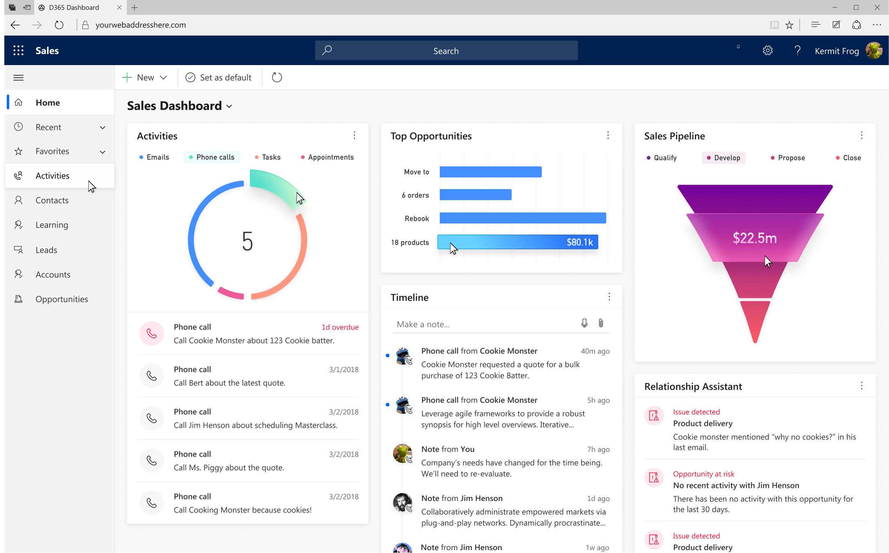

> How might we create a modern, cohesive, and usable design system that can be easily adopted by all D365 apps?

Microsoft’s Dynamics 365 needed to update their vast family of CRM and ERP applications to follow a common, federated design language that sits under the same roof as Microsoft’s Fluent Design.

Over the course of six months, I joined a small federated team to organize a robust, adaptable style guide and component library that has since been elevated to affect change at a company-wide level.

The old Dynamics 365 Sales platform. This was the best of the best as far as D365 apps go. It gets the job done but the look and feel could be improved and the NPS score was in the gutter.

The vision work for where we wanted to take our style guide and component library. 

## Background

It had been a year since Microsoft announced their push to make the company more design-centric and release Fluent Design. Within that year, significant progress was made on redesigning the Windows platform and Office was getting close to releasing their Fluent redesigns. Dynamics 365 is widely seen as the little brother to Office, and as such, is expected to provide an equally modern experience.
Dynamics 365 was released in 2016 and is is expected to triple is revenue by 2020, likely giving it the marketshare crown in the CRM industry. However, we faced a handful of big hurdles. Most of the stemming from the following:

### PROBLEMS AND CONSTRAINTS

1. There wasn’t a unified and documented design system. Every one of the nearly two dozen D365 apps were loosely based on one another (and some took more, but there is no real direction for controls, patterns, visuals, etc.
2. Compounded by the previous issue, NPS scores were abysmal, and customers were frequently confused and even pissed off by tasks that should be very straightforward. If they aren’t brought up soon, the future of our apps is bleak.
3. There are nearly two dozen apps making up 11 core areas of Dynamics 365, and they all have slightly different use-cases. We need to account for all of these.
4. Our understanding from high leadership was that the most important thing for us to achieve was high-level alignment with Office. Navigation, colors, etc. However, they didn't have data dense products and their controls were neither working for our use-cases nor were their Fluent designs even published out yet. Not to mention they moved extremely slow for what we required.
5. Accessibility is very important to Microsoft and a number one priority for me.

> The system we design has to be strict enough to make our apps usable and feel cohesive, yet flexible enough to not stifle creative freedom.

## My Role

When I heard I’d be coming over to work on Dynamics 365, I decided I was going to do everything I could to make enterprise level B2B applications less boring. The idea was to have a federated team of designers from various teams that would volunteer to build this system in their extra time. Myself and five other designers and a design manager ended up working on the design system. I was volunteering on top of usual workload and ended up taking a rather large chunk of extra work because I knew how important it would be for my team to have a voice in the room. My responsibility was designing all input controls; buttons, chips, text fields, search fields, dropdowns, toggle switches, sliders, radio buttons, and checkboxes, as well as documenting the patterns in which they are used. I also had a hand in helping design nearly every other component in the library. These are all now rolling out to all $2 billion dollars of Dynamics 365 applications and will soon account for the largest market share of CRM and ERP software.

## Process

Step 1: Create an inventory of UI examples and start assembling components. This is a first step that I also used frequently when working on my team's app to help get inspiration, see what competitors are doing, and spot solutions to potential issues that could easily be overlooked.

Step 2: Start creating various solutions and refine based on stakeholder feedback.

Step 3: Document each control and pattern.

## Lessons Learned

We knew that this was a challenging project. It was more than creating a design system-
 it meant reigning in and bringing consistency to a constellation of design teams. As with most projects, there are things we got right and things we could have done better.

### Personally

I took on a huge chunk of the library. As our vision developed, it turned into more work than anyone could have anticipated. But it was also a blast. I was completely addicted to building this system for that six months. So it ended up eating into my work/life balance more than I care to admit.

### Documentation

We knew this would be significant, but we didn't realize exactly how significant. While getting the look/feel/UX of the controls mattered to us and the end-users, the documentation is what mattered to our direct stakeholders (designers on other teams) that were to consume the library. After our initial release, a large chunk of the feedback we received centered around needing more documentation. There was a surprising lack of desire for freedom in how our system was implemented.

### Accessibility

I thought I understood accessibility. I thought we all did. We had all been through extensive workshops and were all experienced designers working on our own applications. It turned out that all of us still had a lot to learn. Sometimes issues came in the form of small oversights (like learning that placeholders must meet contrast ratios), and sometimes huge mistakes (like realizing that design teams needed an accessibility toolkit to use in their specs with design handoffs. Whoops.)

## Conclusion and learnings

While this was a huge task for Dynamics to take on, we found that creating our own Dynamics 365 Fluent Design system was worth the investment and a huge leap forward for the Dynamics family of apps.

The project also molded me into a significantly better designer and I tweeted out some of my learnings;

[https://twitter.com/AustinTByrd/status/1131540380694982657](https://twitter.com/AustinTByrd/status/1131540380694982657)

[https://twitter.com/AustinTByrd/status/1101829574474776576](https://twitter.com/AustinTByrd/status/1101829574474776576)

[https://twitter.com/AustinTByrd/status/1102917686105964545](https://twitter.com/AustinTByrd/status/1102917686105964545)

[https://twitter.com/AustinTByrd/status/1102555301465731075](https://twitter.com/AustinTByrd/status/1102555301465731075)

[https://twitter.com/AustinTByrd/status/1150743567272423424](https://twitter.com/AustinTByrd/status/1150743567272423424)

[https://twitter.com/AustinTByrd/status/1134092623164010496](https://twitter.com/AustinTByrd/status/1134092623164010496)

Since releasing our design system and toolkit, all Dynamics design teams became centered to a common "truth" in the components they should be using. We expect NPS score to skyrocket, and design is now faster for the entire organization and subsequent development teams now have guidance on what "Fluent design" meant. Additionally, engineers and designers now share a common language, meaning the many platforms could, in the future, use one single React library.

Design teams were ecstatic about the system. Overnight it turned wall reviews from splitting hairs over things like padding, colors and type choices to enabling all of us to focus on the actual concepts and experiences of a design.

All of our goals were met and the vision was to continue quarterly releases for design teams. However, our effort ended up being "too" successful. It caught the eye of multiple higher-ups and they liked it so much they decided to elevate the library and use it as a future framework for Fabric (Microsoft's Fluent Design code component library). They moved our design manager to a leadership position on the Fabric team, gave him a large budget to hire his own full-time design team, promoted his boss, and disbanded our federated team. Further, the clear guidance for all Dynamics teams was to now shift back to using the existing Fabric controls, rather than scrambling to build our own code library, so our design system could then be implemented in further updates for free.

It was bittersweet. I was both extremely proud to understand the impact I had at Microsoft, while at the same time, quite melancholy to be taken away from the library of pixels that I obsessed over for six months.

I believe that aided with these systems we can focus more on actual user experiences and concepts we want to create in the future.

[https://www.figma.com/file/Cz62qCDKisRxOn0Sd2gNjx0A/Dynamics-Fluent-Design?node-id=0%3A2](https://www.figma.com/file/Cz62qCDKisRxOn0Sd2gNjx0A/Dynamics-Fluent-Design?node-id=0%3A2)