 

Documented here is an overview of the Market Insights app for Microsoft. A deeper study can be expected during interviews which goes further in-depth into the iterative process.

> How might we amplify the abilities of professionals and transform them into confident, highly skilled experts within their industry?

Over the course of two months (documented, here but ongoing), I worked with team of three other designers plus a principal to craft and launch the Market Insights app for Microsoft's Dynamics 365 suite of products. Each of us were assigned primary ownership over a feature area.

## My role

On my Microsoft team, I designed the onboarding experience, the settings, and laid the initial groundwork for the insights feed.

# Before and after

## Before

We started off with a hyper small service that allows users to create and manage a daily or weekly newsletter. They tell us the topics they're interested in, and we send them a newsletter. You can still find this experience at [alerts.microsoft.com](http://alerts.microsoft.com). I didn't have much to do with this design beyond helping critique, but I'll show it here for context:

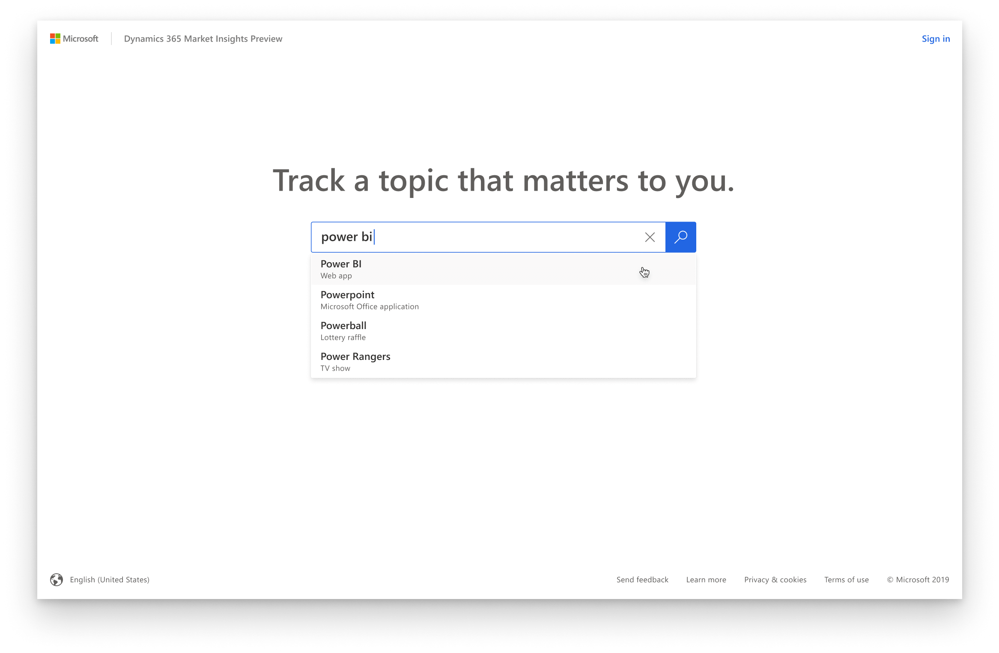

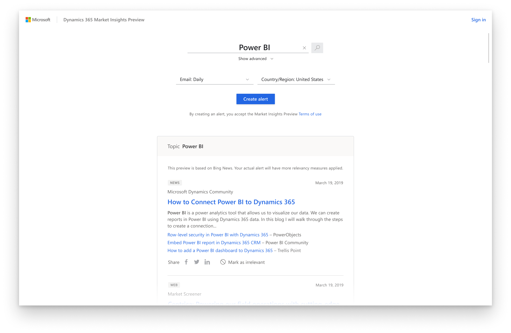

To keep things as simple as possible for an MVP, we landed on three screens plus an onboarding experience.

## After

### The first run experience

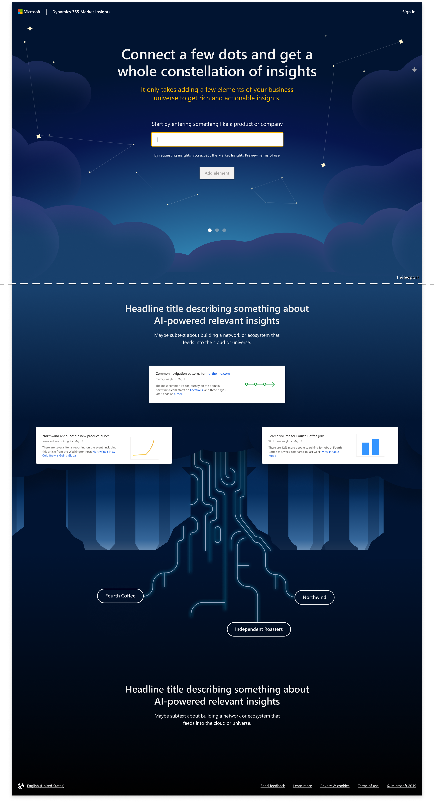

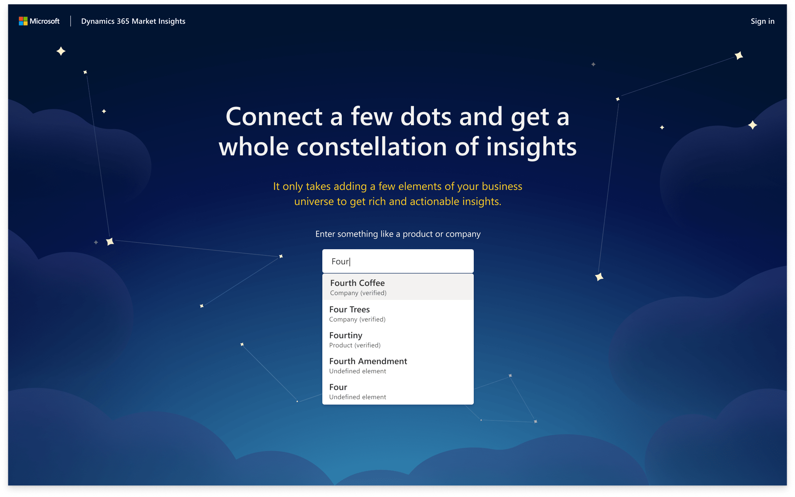

The first view that the user sees asks them for a product or company. We use assisted query so we can map the input directly to a database entity.

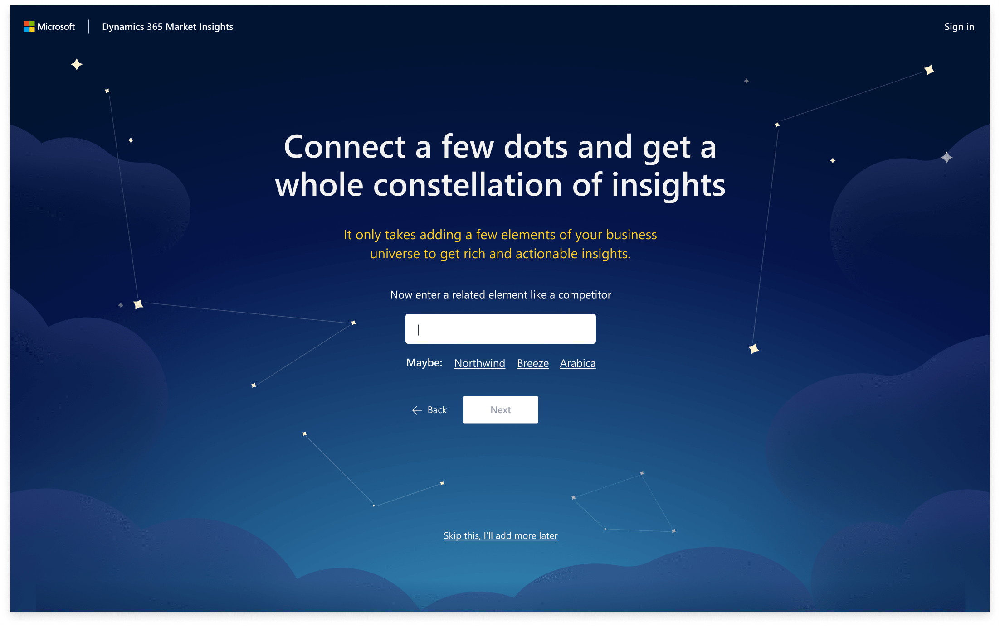

We then asked for an optional second input. Our data science team found that the insights we could provide were significantly more important when we had a competitor to compare their input to. 

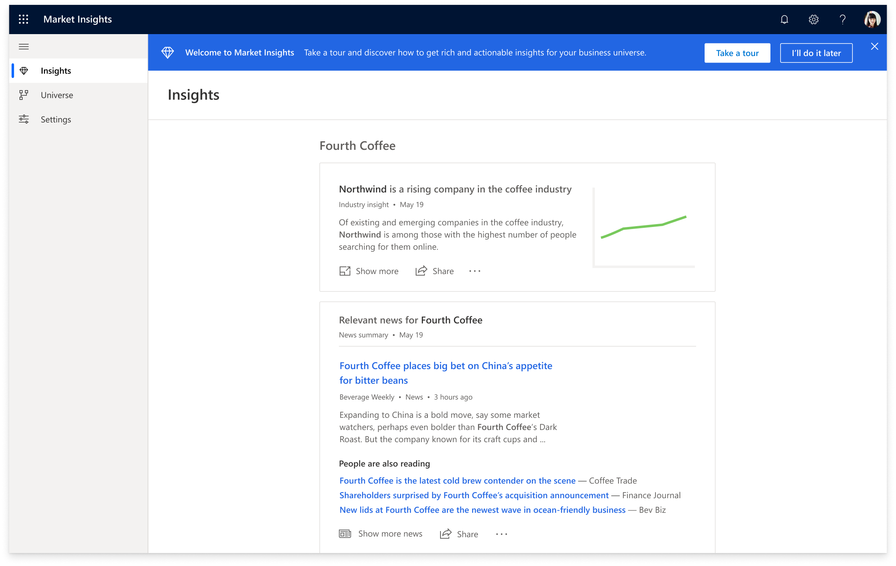

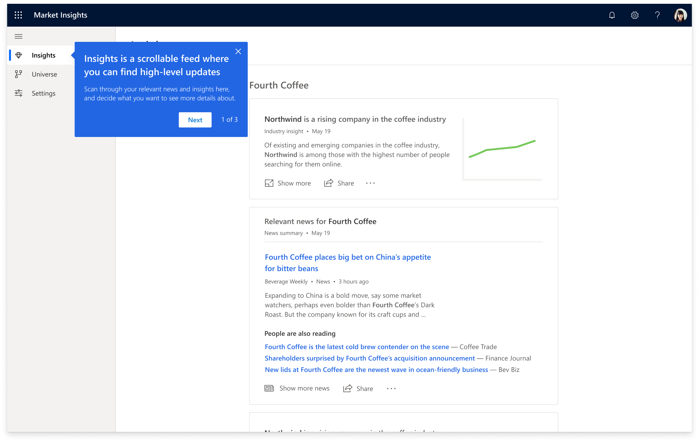

### Insights feed

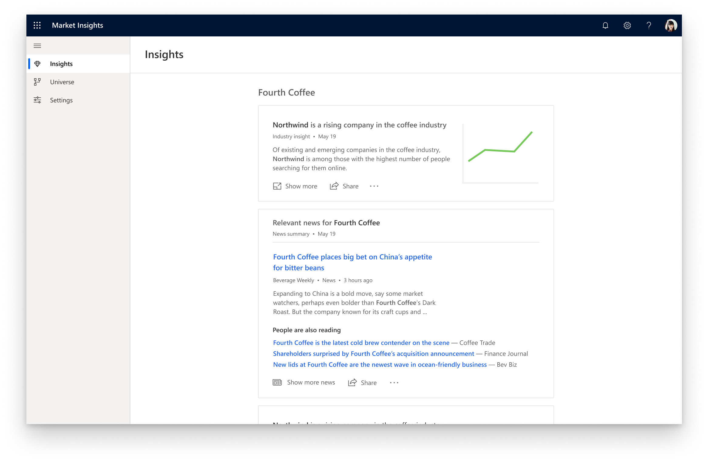

From the Insights feed, users can click on "Show more" to enter into a detailed view that reveals more relevant insights and related news. The insights card from the main feed would also show more details. It was difficult determining exactly how much detail we should show on the main feed.

### Emails

I designed an email newsletter of insights and alerts that could be sent daily, weekly, or as events happen. Below shows every insight we designed at for the initial launch of the product.

Our goal here was to attempt to match the insights feed as closely as possible, with an except to the CTA buttons, because the actions were inherently different.

I helped a dev prototype these in Storybook.js as inline-styled react components.

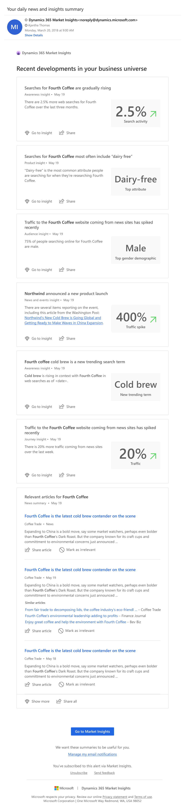

There were other edge-case emails as well, for example, this welcome email.

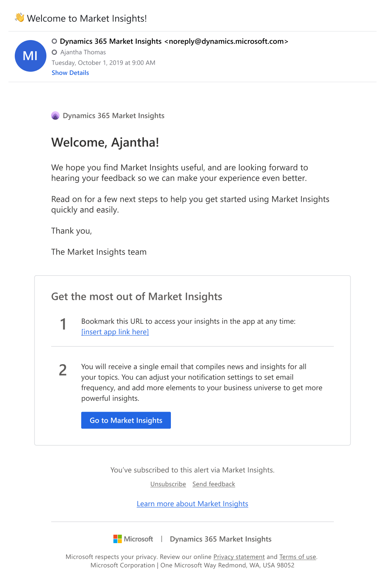

### Settings

Users come here to  manage their notification and change their account information. I wanted this to be flexible and leave the door open to many different architectures because we knew that there was going to be a lot added here in the future.

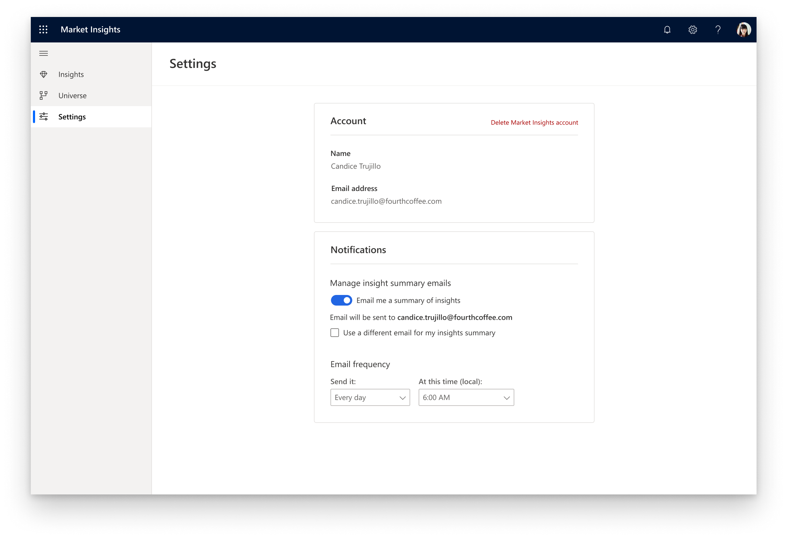

We mocked up and I prototyped breakpoints for all screens and how the sidenav was to behave.

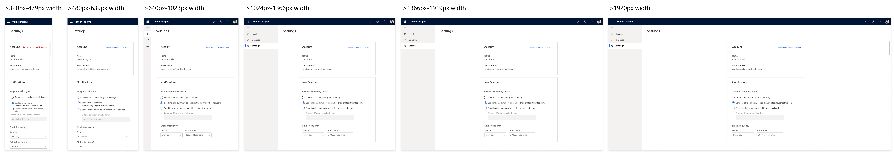

### Universe map

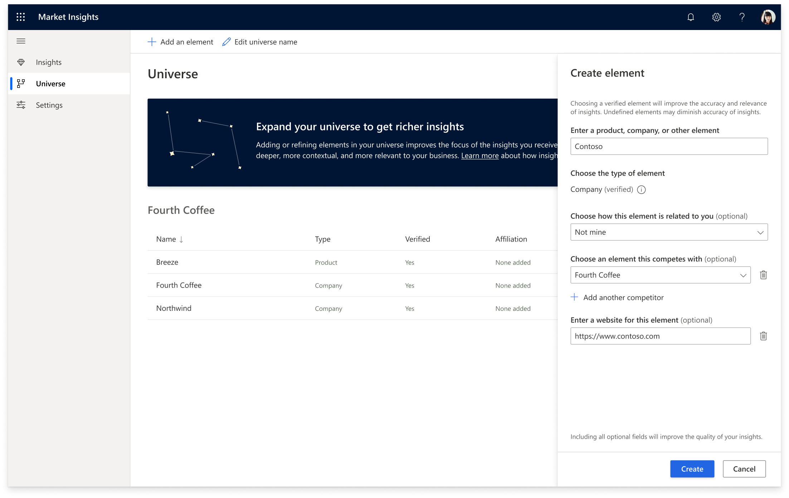

# Background

One of Microsoft's core competencies is having powerful artificial intelligence, and we wanted to invest heavily in a group of apps that utilizes this. Market Insights was one of these.

## Problems and constraints

1. Improper planning cut our 6-month expected runway down to only a few weeks.
2. We had to use a component library called Fabric and the selection was quite limiting [see here]. It could have gone much smoother [link here]. For the sake of our devs, we tried to only change small aesthetic attributes of the controls. This was also limiting because the Fabric design components had been imported over from Sketch and the library was very broken- we had to rebuild much of it within Figma local libraries.
3. There wasn't yet a tried and true framework for a first-run onboarding experience within the Dynamics suite of apps. One experience took over an hour of sitting through a series of 15-minute load screens and active clickthroughs followed by a 24-hour wait period where you could "test drive" the app with dummy data.
4. The idea of AI is still fairly new and we have to pave the way with a lot of uncertainties.
5. Accessibility is always a top priority at Microsoft.

## Process

Every design project I tackle is different. This  project was a bit odd because external factors created more chaos than usual (We had quite a very fire drills between each of these steps)

1. Gather as much available information from PM's as possible. Create vision decks. Sit through a million meetings and discuss what the product could be.

2. Create the barebones "crawl" version of the application.

3. Get feedback from non-design stakeholders and do some research.

4. Make final tweaks, deliver, and figure out what we did wrong.

# The take away

This project was a masterclass in cooperating with PM's and dealing with high-pressure situations with challenging deadlines.
