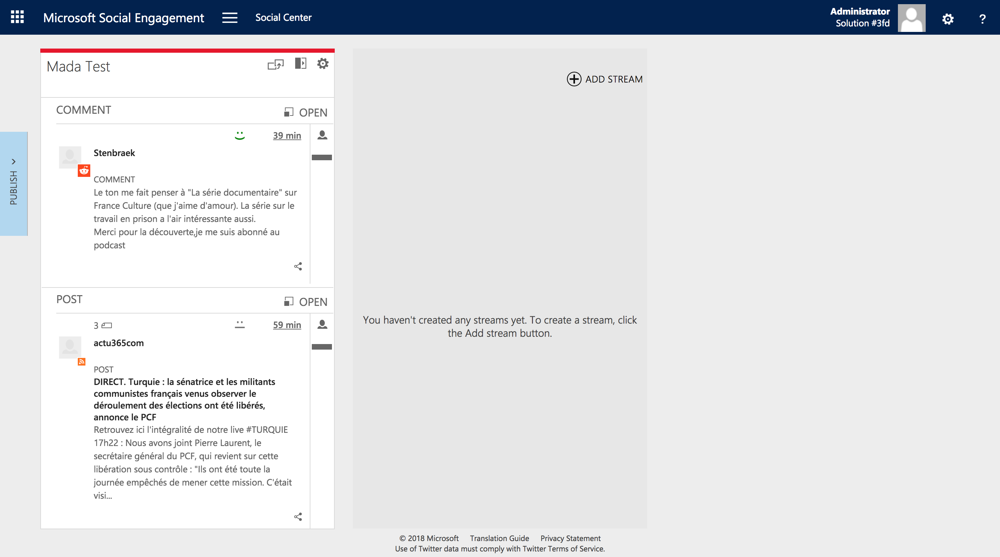
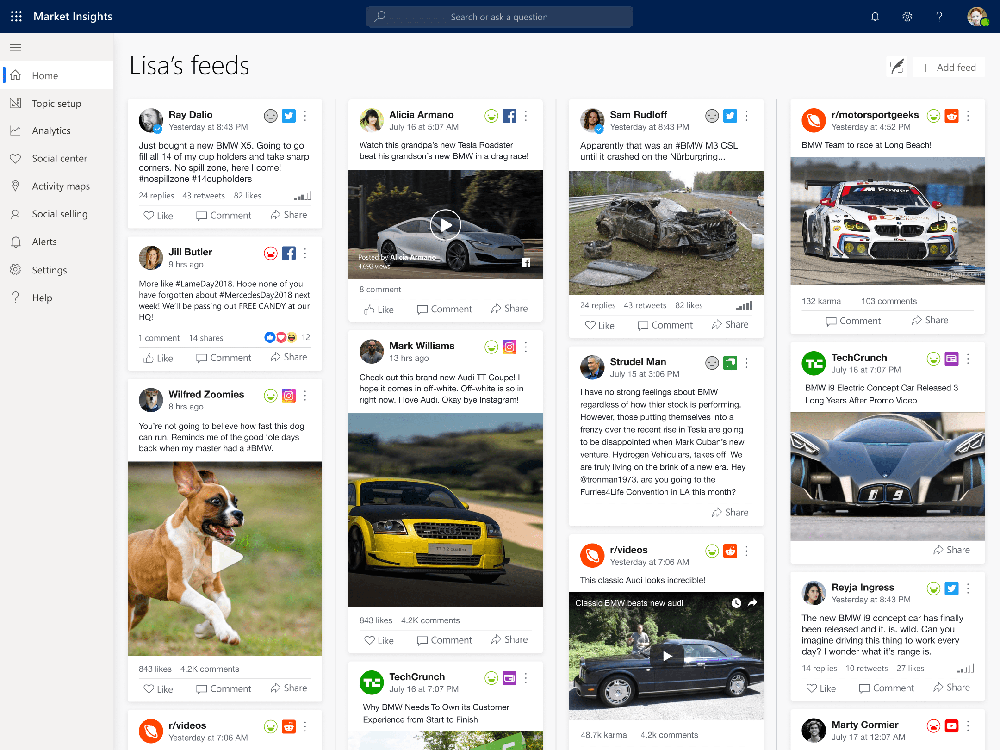

# Overview

Microsoft Social Engagement was a startup 15 years prior that Microsoft had acquired for the Dynamics 365 family of apps. The purpose of MSE was to help professionals monitor, track, and respond to their presence online.

Over that period of time, the app experienced 15 years of feature creep with no designers involved. NPS scores were completely abysmal, and it was our job to redesign MSE into a spectacular app.

## Before

## After

