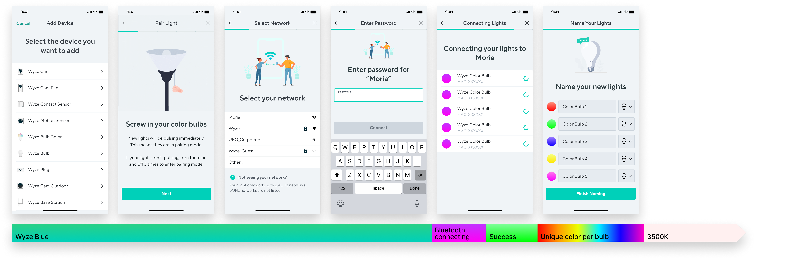

## Background

Wyze Labs, a leader in affordable smart home products with millions of customers, was ready to dramatically expand their line of smart lights.

## My role

Over the course of two months, while working on other products, I was the lead designer over the entire product design process. This included visual design, product and platform strategy, and guided industrial design.

> How might we craft a better smart color bulb experience than competitors that are 4X more expensive?

## Constraints and Problems
- Needed to scale beyond a color bulb to all future lighting products
- Limited resources.
- The existing app had a lot of issues and no design system.
- All developers were in China. There were both language and cultural barriers.
- Wyze Labs has millions of users, but no researchers to figure out who these users were.
- Users currently by smart color bulbs as toys. I wanted to create something more mature than that which can work as a temporary toy, and as an upgrade from the 100+ year old standard light bulb.

### User research
With a small research budget, statistical significance for usability studies is around 5 participants. Our problem is that we didn't have a research budget. So rather than getting expensive quantitative numbers, the approach we took was to rely on qualitative insights (from interviews and walkthroughs) to drive the design.
Usability fixes could be found the walkthroughs, from beta testing, and by slowly rolling out changes to the existing white bulb.

- Conducted 5 user interviews. A question template can be found [here](https://www.notion.so/Color-Bulb-user-questions-209eb8afbb944433b7f2857844eae682)
- Ran 2 rounds with 3 users tests each to find usability issues and verify assumptions.

## What we learned
User research told us a lot. People think about smart bulb apps to do the following simple tasks:

1. Control their smart bulbs to change color or color temperature
2. Set "Scenes" (or presets) that could be controlled by a voice assistant

We also learned the following:

- Walkthroughs of the design found usability issues and influenced every aspect of the design.
- People don't buy color bulbs because they need color bulbs. They buy them for their <b>desireability</b>. The interface needs to be highly desireable.

### Core experience

The goal was to create an interface that could be used as little as possible. But when it was used, it was a highly desireable and beautiful experience.

My usability study found that some users struggled to know what they should do when they first enter the interface. But I wanted to keep Scenes as the first navigational item to encourage their use. So I added an obvious + card (top left) that would send users to the Design tab.

Above, you'll see some of the documentation I put together to help the developers figure out how to create the interface.

### Setup

Customers online would frequently mention a few key delightful moments when setting up competitor bulbs:

- How fast the setup process was.
- How bright the bulbs were when they first turned on.

I also wanted the setup to be an experience itself. Color bulbs can be an extension of the phone interface.

As the user is setting up their bulbs in a room, the lights would change color based on where they're at in the flow. This is used to indicate success/failure, help with troubleshooting, and is beautiful.

The biggest constraint with setup is that I needed to use screens that were consistent with existing products. They felt dated and didn't match the interface.

I optimized the setup experience for groups of bulbs, since we had an existing white bulb on the market and learned that single bulbs weren't economical. We also didn't want to compete with lava lamps- our goal is to position ourselves to compete with dumb bulbs. That's where the real opportunity is.

It was very important that this experience was personal. Another key delightful moment in setup is the ability to personalize their lights to match the fixtures that they're in.

### Circadian Rhythm

A feature I drove and designed was the idea of a a "circadian rhythm" mode.

The truth is, a smart bulb creates more problems than is solves out of the box. You aren't able to use a light switch with it. We had a smart switch planned, but I wanted a reason for our smart bulb to be better than a dumb bulb beyond being able to use an app. The idea was that when you turn the bulb, it would fade between the perfect color temperature relevant to the time of day. This not only sets the ambiance, but also has signficant scientific benefits on sleep and wellness.

The biggest constraint here is the styling had to match the existing platform for consistency reasons.
Ideally most users would simply turn this feature on.

## The take away

This project is launching soon and I can't wait for users to get their hands on it! The next step will be to aggressively pursue a full line of lighting products, including a smart switch which is predicted to be one of our top selling products.

There were a lot of takeaways from this project, but the most valuable is how powerful a tight Designer/PM relationship could be.

