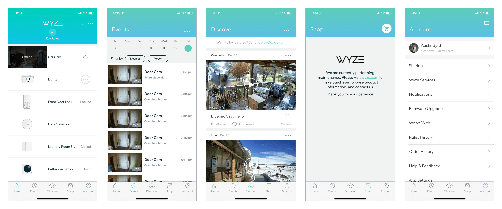
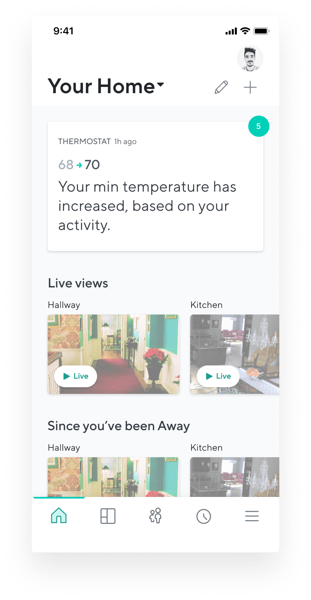
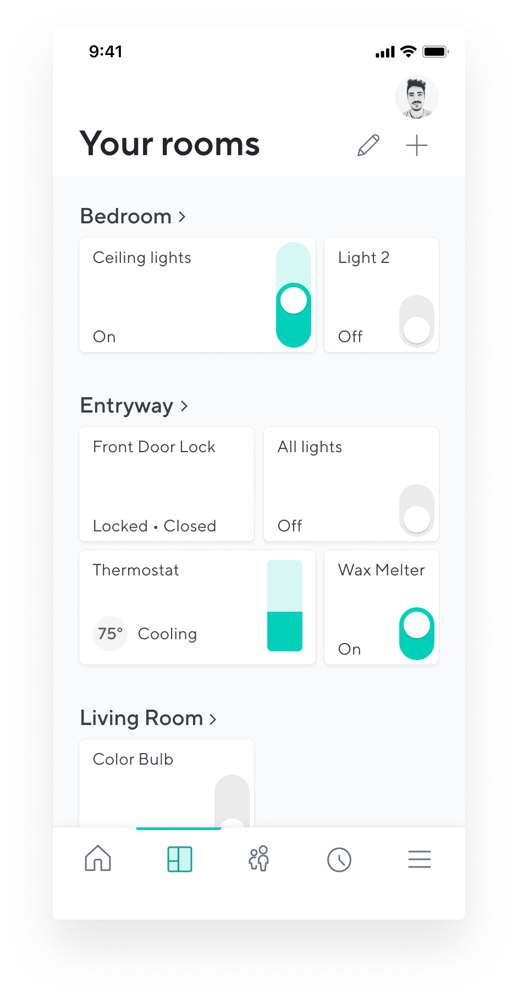
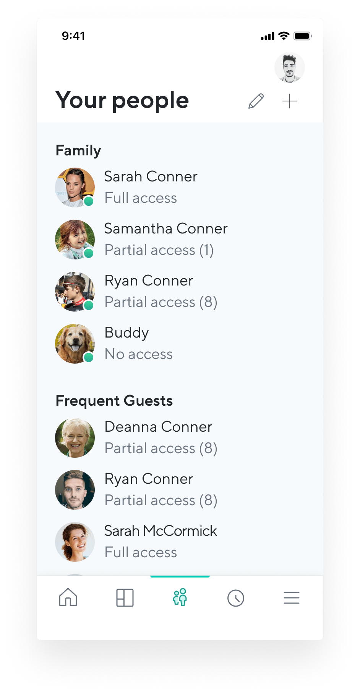
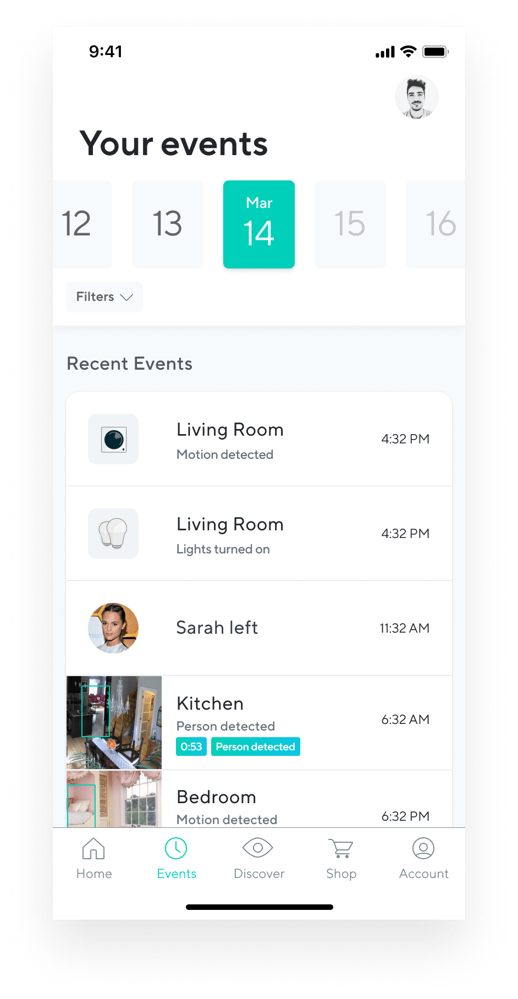
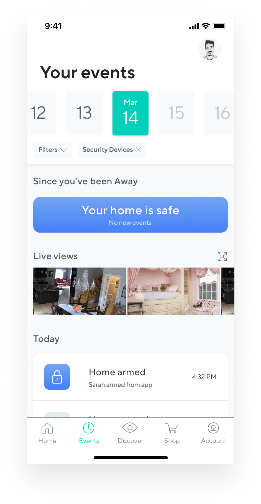
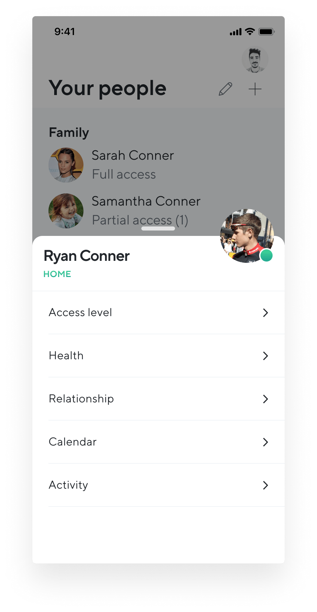
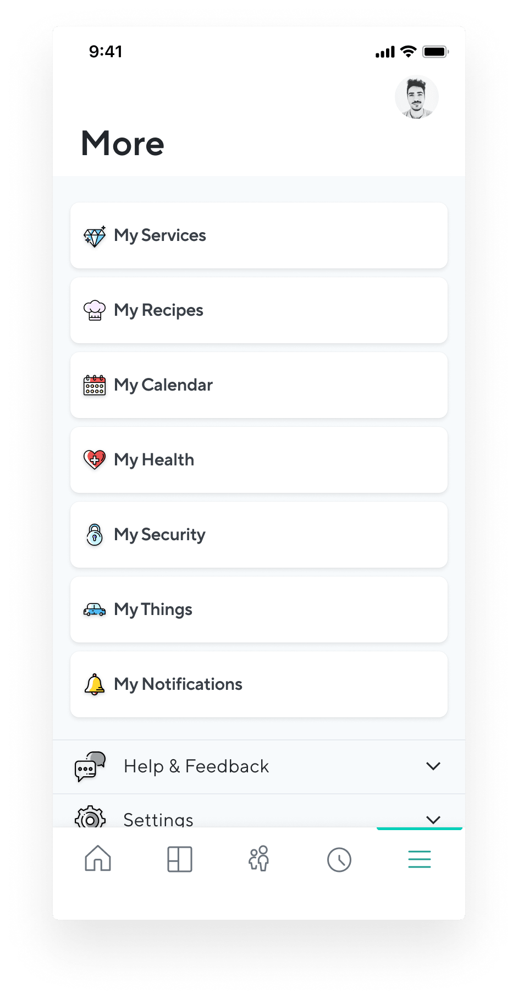

## Background

The existing Wyze app was bad. The design team ran a System Usability Scale (SUS) test, and the app earned a D. There was no clear design system that was followed. It was the newly formed design team's goal to put forth 3 concepts to show what the Wyze app should be. We would then create a design system from one of the directions. My designs were the chosen direction.

## My role

I was responsible for all direction and designs to demonstrate what we are realistically capable of.

### Core experience

The goal was to create an interface that could be used as little as possible. But when it was used, it was a highly desireable and beautiful experience.

Here's my portion of the pitch deck that was used to decide on a direction for the mobile app:
<iframe style="border: none;" width="800" height="450" src="https://www.figma.com/embed?embed_host=share&url=https%3A%2F%2Fwww.figma.com%2Fproto%2FBXMl9BnJGBgxvJjjiYoOJ2%2F3X%3Fnode-id%3D424%253A28%26scaling%3Dmin-zoom" allowfullscreen></iframe>
